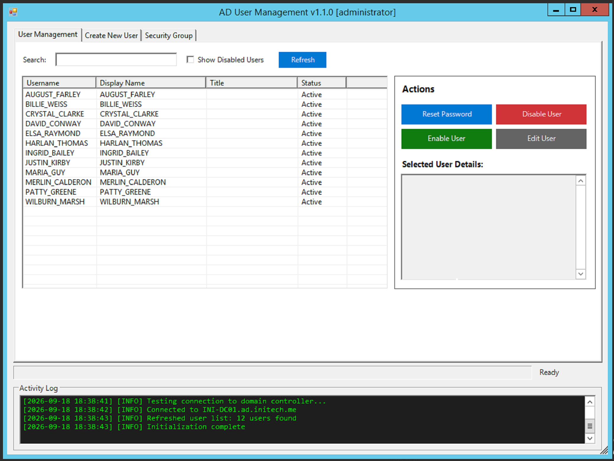
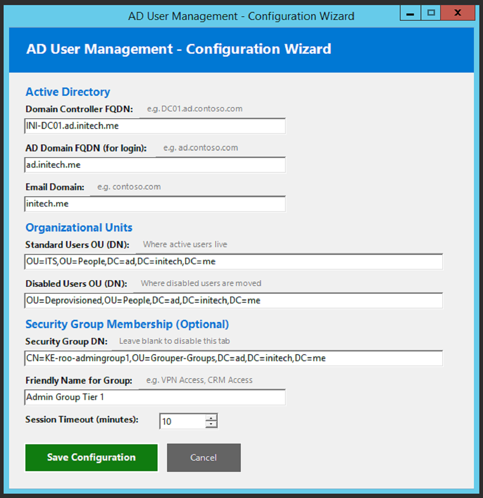
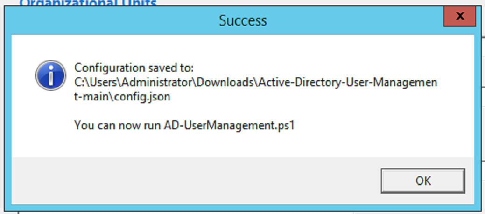
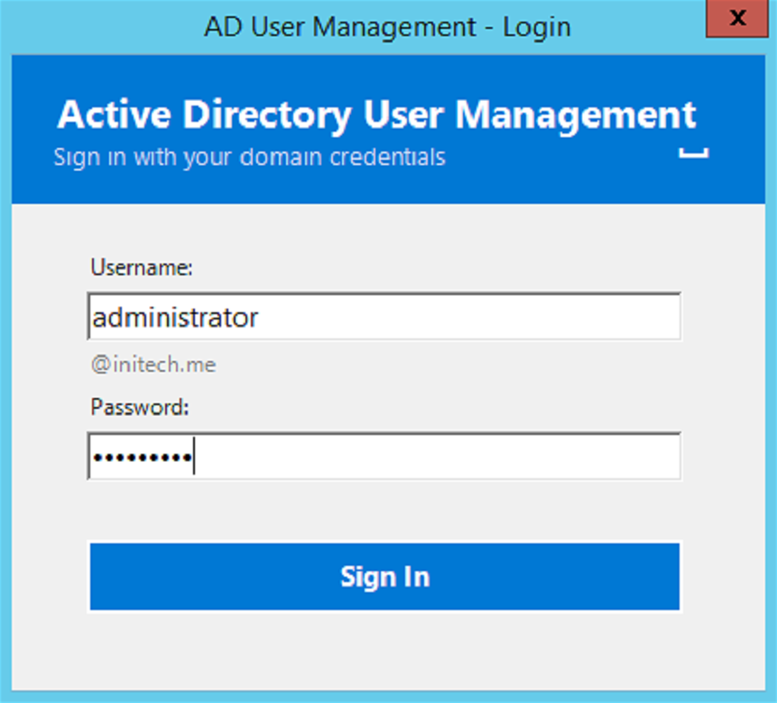
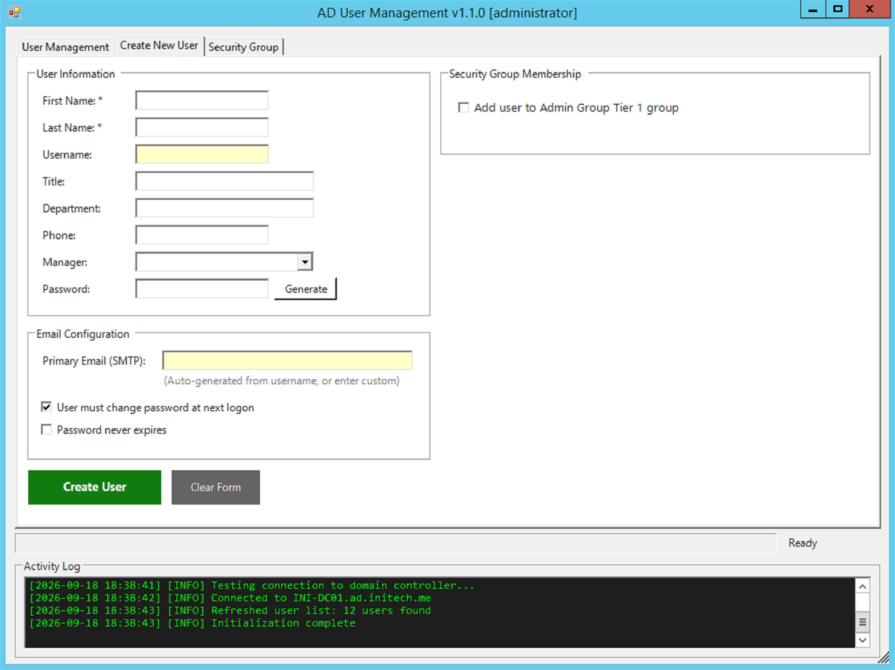
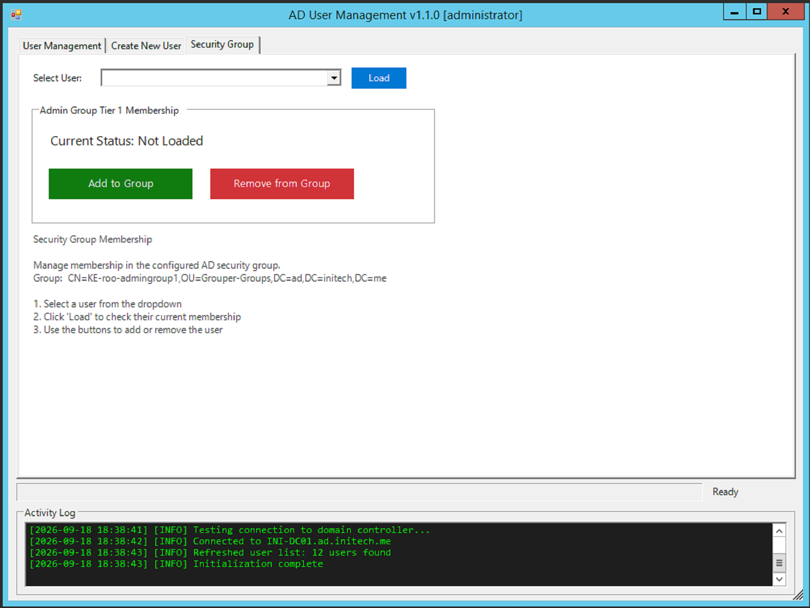

# AD User Management Tool

Read the blog post that inspired the tool: https://trgsys.com/blog/ad-user-management-blog

A PowerShell-based GUI tool for managing Active Directory users and security group membership. Designed for IT administrators and helpdesk staff who need a simple, consistent interface for common AD tasks without requiring RSAT or direct access to Active Directory Users and Computers.




## Features

**User Management**
- View all active or disabled users from configured OUs
- Edit user attributes (name, title, department, phone, manager, email/UPN)
- Reset passwords with cryptographically random generation (always meets AD complexity)
- Disable accounts (disables + moves to Disabled OU)
- Enable accounts (enables + moves back to Standard OU)

**Create New User**
- Auto-generates username and email from first/last name
- Sets UPN, primary SMTP, and proxyAddresses in one step
- Assigns manager, title, department, phone
- Optionally adds user to a configured security group
- Configurable password policy (must change at logon, never expires)

**Security Group Membership**
- Check if a user is a member of a configured AD security group
- Add or remove users with one click
- Tab is hidden automatically if no group is configured

**Session Security**
- Domain sign-in at launch; the credentials entered are used for every AD operation, so a technician can run the tool from their normal desktop session and sign in with a separate admin account
- Configurable inactivity timeout with re-authentication
- All operations performed via PowerShell Remoting (no local RSAT required)
- Generated passwords are shown once and copied to the clipboard only on request

## Requirements

- Windows 10/11 or Windows Server 2016+
- PowerShell 5.1 or later
- Network connectivity to the Domain Controller
- PowerShell Remoting (WinRM) enabled on the Domain Controller
- An AD account with [delegated permissions](#permissions-and-delegation) on the target OUs

## Quick Start

1. Download or clone the repository
2. Run the configuration wizard to generate `config.json`:
   ```powershell
   .\Configure-ADUserMgmt.ps1
   ```
3. Launch the tool:
   ```powershell
   .\AD-UserManagement.ps1
   ```
   The scripts are unsigned, so on a machine with the default `Restricted` execution policy launch them with:
   ```powershell
   powershell.exe -ExecutionPolicy Bypass -File .\AD-UserManagement.ps1
   ```

See [SETUP.md](SETUP.md) for detailed setup instructions, including how to find your OU distinguished names and configure delegation.

## Walkthrough

### 1. Configuration wizard (`Configure-ADUserMgmt.ps1`)

A single dialog with a blue header bar and three sections:

- **Active Directory** - Domain Controller FQDN, AD Domain FQDN (used for sign-in), Email Domain
- **Organizational Units** - Standard Users OU and Disabled Users OU, as distinguished names
- **Security Group Membership (Optional)** - the group's DN and a friendly display name; leave the DN blank to hide the Security Group tab
- **Session Timeout** - 1 to 120 minutes, default 10



Each field has a gray hint beside its label showing the expected format. **Save Configuration** validates the required fields, writes `config.json` beside the script, and confirms the path. Re-running the wizard pre-fills the saved values. Enter saves, Esc cancels.



### 2. Sign in



Launching `AD-UserManagement.ps1` opens a sign-in dialog: a **Username** box pre-filled with your Windows username (the email domain is shown beneath it), a **Password** box, and a **Sign In** button (Enter submits). The credentials are verified against the domain and then used for every AD operation, so you can sign in with a delegated admin account while logged on to Windows as a standard user. A wrong password shows "Invalid username or password." and clears the password box; closing the dialog exits the tool.

After the inactivity timeout the main window hides and this dialog reappears with "Session timed out. Please sign in again." Signing in resumes where you left off.

### 3. Main window


The title bar shows the version and the signed-in account. The window opens on the User Management tab, is resizable, and has three areas:

- **Tabs** filling most of the window: *User Management*, *Create New User*, and (when a group is configured) *Security Group*
- A **progress bar** with a status label ("Ready", "Querying AD...", "Resetting...")
- An **Activity Log** along the bottom with timestamped `[INFO]` / `[ERROR]` lines for every operation

On open the tool tests the DC connection, loads the manager list, and fills the user list. If the connection fails, a message box lists the usual causes (network, WinRM, permissions).

### 4. User Management tab

Top row: a **Search** box that filters the list as you type (username, display name, title, email), a **Show Disabled Users** checkbox that switches the list from the Standard Users OU to the Disabled Users OU, and **Refresh**.

Left: a grid of Username / Display Name / Title / Status. Right: an **Actions** panel with **Reset Password**, **Disable User**, **Enable User**, and **Edit User**, above a read-only **Selected User Details** box showing the highlighted user's username, display name, title, department, phone, email, status, and proxyAddress aliases.

- **Reset Password** generates a password and shows it in a confirmation prompt. On Yes it sets the password with *must change at next logon* and shows it once more with an offer to copy it to the clipboard.
- **Disable User** confirms, then disables the account and moves it to the Disabled Users OU. **Enable User** does the reverse - tick *Show Disabled Users* to find the account first.
- **Edit User** opens a dialog with First / Last / Display Name, Email / UPN (with a warning that changing it affects sign-in), Title, Department, Phone, and a Manager dropdown. **Save Changes** writes the attributes; if the email changed it also updates the UPN, `mail`, and the primary SMTP entry in `proxyAddresses`.

### 5. Create New User tab



Three group boxes:

- **User Information** - First Name and Last Name (required; typing both auto-fills **Username** as `first.last` and the primary email), Title, Department, Phone, a Manager dropdown of active users, and Password with a **Generate** button
- **Security Group Membership** - one checkbox to add the new user to the configured group (hidden when no group is configured)
- **Email Configuration** - Primary Email (SMTP), auto-generated from the username but editable, plus *User must change password at next logon* and *Password never expires*

**Create User** creates the account in the Standard Users OU, sets UPN, `mail`, and `proxyAddresses` in one step, assigns the manager, adds the group membership if ticked, and shows the username, email, and password with an offer to copy the password. **Clear Form** resets every field.

### 6. Security Group tab



Shown only when `SecurityGroupDN` is set. Pick a user from the dropdown and click **Load** to see *Current Status: MEMBER* or *NOT A MEMBER*, then **Add to Group** or **Remove from Group** (removal asks for confirmation). Each change is written to the Activity Log.

## Permissions and Delegation

**This tool does not enforce its own access control.** The login screen verifies the credentials against the domain and then uses them for every AD operation, but it does not check group membership. Access control is handled entirely by Active Directory permissions. If a user without the proper delegated rights signs in, they will authenticate successfully but every AD operation will fail with "Access Denied."

### Who Should Use This Tool

This tool is intended for members of a **delegated AD administration group** such as:

- `Helpdesk-UserManagement`
- `IT-ADAdmins`
- A custom group your organization creates for this purpose

**Do not distribute this tool to end users.** While they cannot cause damage without delegated permissions, the error experience is poor and the tool exposes internal OU structure and DC hostnames.

### Recommended Delegation Model

See [SETUP.md](SETUP.md) for step-by-step delegation instructions. In summary, create a dedicated security group and delegate the following rights on your Standard Users and Disabled Users OUs:

| Permission | Needed For |
|------------|-----------|
| Reset Password | Password resets |
| Create/Delete User Objects | Creating and managing accounts |
| Write All Properties (User objects) | Editing user attributes |
| Read All Properties (User objects) | Viewing user details |
| Modify Group Membership (on the security group) | Security group tab |

Members of **Domain Admins**, **Account Operators**, or any group with broad AD write access can use the tool without additional delegation.

### Optional: Restrict Who Can Launch the Tool

If you want to prevent unauthorized users from even opening the tool, add a group membership check at the top of `AD-UserManagement.ps1`. See [SETUP.md](SETUP.md) for a ready-to-use code snippet.

## Configuration

All environment-specific values are stored in `config.json`, generated by the configuration wizard. This file is excluded from version control via `.gitignore`.

| Setting | Required | Description |
|---------|----------|-------------|
| DomainController | Yes | FQDN of your Domain Controller |
| DomainFQDN | Yes | AD domain FQDN used for login (e.g. `ad.contoso.com`) |
| EmailDomain | Yes | Email/UPN domain (e.g. `contoso.com`) |
| StandardUsersOU | Yes | Distinguished Name of the OU where active users reside |
| DisabledUsersOU | Yes | Distinguished Name of the OU where disabled accounts are moved |
| SecurityGroupDN | No | DN of a security group to manage (leave blank to hide the tab) |
| SecurityGroupName | No | Friendly display name for the group (e.g. "VPN Access") |
| SessionTimeoutMinutes | No | Inactivity timeout in minutes (default: 10) |

## File Structure

```
Active-Directory-User-Management/
  AD-UserManagement.ps1        Main tool
  Configure-ADUserMgmt.ps1     Configuration wizard
  config.json                  Generated config (gitignored)
  README.md                    This file
  SETUP.md                     Detailed setup and delegation guide
  images/                      README screenshots
  CHANGELOG.md                 Version history
  LICENSE                      MIT License
  .gitignore                   Excludes config.json
```

## License

[MIT](LICENSE)
